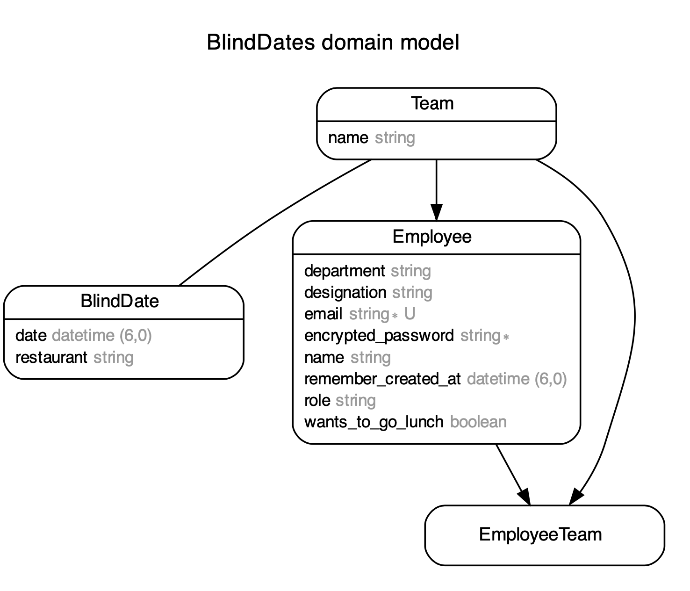

# Learning Assessment
## Homey
### Project Requirements are in BlindDates - Technical BlindDates File


The aim is to express my level of skills and knowledge as they are required to deal with everyday tasks.
To achieve this purpose, I completed all tasks while keeping in mind the task definition.

Solution:
* I used Ruby on Rails Framework for Development.
* Ruby (Version: 3.2.2)
    * CMD (bundle install)
* Rails (Version: 7.0.4)
* Database - PostgreSQL
* Database creation
* Database initialization
    * CMD (rake db:setup)
      Heroku-Server Link: https://pure-hamlet-95964.herokuapp.com/
    * I added initial records in db:seed

* For Test Cases I used (Rspec)
* How to run the test suite
    * CMD (bundle exec rspec spec)

* Running instructions:
    * CMD (./bin/dev) (it will load the Tailwind css properly)
      Heroku-Server Link: https://pure-hamlet-95964.herokuapp.com/

# Run the Rails Application using Docker

host: localhost -> host: database

##### First need to Uncomment 3 lines in database.yml
##### Which includes host, username, and password.
##### Then run these commands:

```
docker compose build
docker-compose run web rake db:create
docker-compose run --rm web bundle exec rake db:migrate
docker-compose run --rm web bundle exec rake db:seed
docker compose up
```
*PS: If you're using MAC then it cause an issue in "apt-get update" cmd in Docker, the solution to this problem is going to "Screen Time" setting and change the settings to "Unrestricted web access".

## Overview

Here Rails applications has four models according to the following database scheme.
* Employee where we can save the detail of email, name, and login authentication mechanism. This employee will work as admin as well for specific case.
* Team which carry the detail of teams which build for every week blind dates, it carries the information of employees and the date and the leader information.
* EmployeeTeam which act as a relation model between employee and team as employee has_many teams and teams has_many employees.
* Blind Dates the important which holds the info of restaurant selected by leader and date on which the event is going to be occur.
* Following ERD will depicts the whole information of all these tables.



There is a Views and Controllers having All the implementations.
## Technical Details
### Views Information


*PS: I just try simple views which shows the technical requirement and needed a lot of improvements in Tailwind CSS.

1. Login Page for Every Employee.
   ```
   URL: http://localhost:3000/employees/sign_in
    ```
   


2. Listed all Current Week Blind Dates.
   ```
   URL: http://localhost:3000/blind_dates
   (Main Functionality which shows all employees with their teams for current week lunch)
   (If the blind date is still not created by admin then it shows that still admin has to create a Blind Date of this week.)
   
    ```
   
  
 
3. Admin Authentication Here only for Employees CRUD 
   ```
    URL: http://localhost:3000/admins/sign_in
    (Need for Restricted Area which is only Employee CRUD)
    (We can add mystery as well and for this just only add "before_action :authenticate_admin!" in mystery controller/
    ```
     


4. Admin Create the Blind Date for Current Week
   ```
    URL: http://localhost:3000/
    (Need for Restricted Area which is only Admin login)
    (We can click on the Create Blind Date button which creates the blind date of this week)
    ```
    

    ```
   After clicking on the Blind Date it checks the employee which are interested and will create the blind dates
   Here take one assumption like group is of normally 5 (+1 person).
   It will select teh leader and check either he is leader in the past 2 months or not.
   It also make sure to disperse the departments and employee as much as in the new group.
   MAke sure they are not in the same group like last time in thsoe 2 months.
   It will also send the Notification Mail to all the Employees the you guys are selected for the Blind date in this group.
   ```
   


5. Admin can view the listing of Employees and add new Employee.

   


6. Admin can view the listing of Last Blind Dates occurs in the Company.

   


7. Admin can view the listing of Teams of all the Employees.

   


8. If Logined Employee is leader of the team, he has the functionality to add the restaurant in it. Otherwise on view it will pop up the leader has to select the restaurant.

   


9. Employee can see all his previous blind dates with the information of Teams and restaurants.

   


10. Employee can update the setting that he want to go to the lunch in future or not. If he/she updates the setting to false the in future he/she will not be included in the Blind Dates.

   

For Further Understanding, please run the code and add seeds.
I already created all the date needed and try to make things Simple as well.
Created helpers to make sure Model and Controllers not become fatty and looks good.
As per request I added Service which Actually creating the Blind Dates
Lastly Mailer is used to send the email, Normally mail has to be sent from Leader Email id but the data is dummy so these emails id's doesn't exist and can;t send email so I choose my dummy created account to send email for notification.


### In Total 12 Test Cases are implemented on localhost testing related to Models Only.
I used Factory method to create the Data.
Further test case should have to implement but it only indicates the the testing is used.
Like Controller, Request, Helpers and Routing


## That's ALL, Folks!

###

##### *** In case something isn't clear or any issue while setup, feel free to contact me. Email Address: hamidiqbal598@gmail.com

## GOOD BYE


